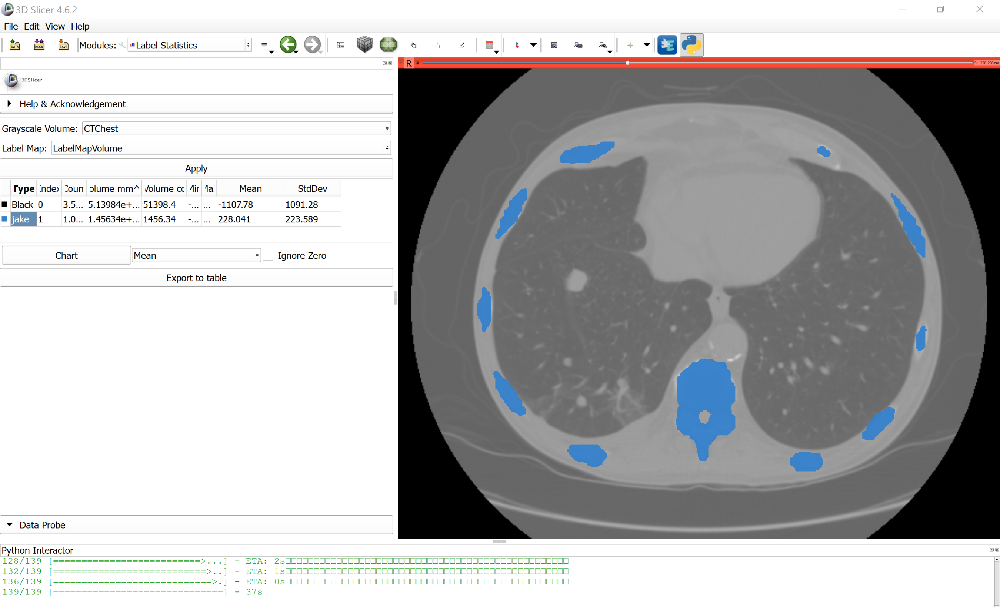
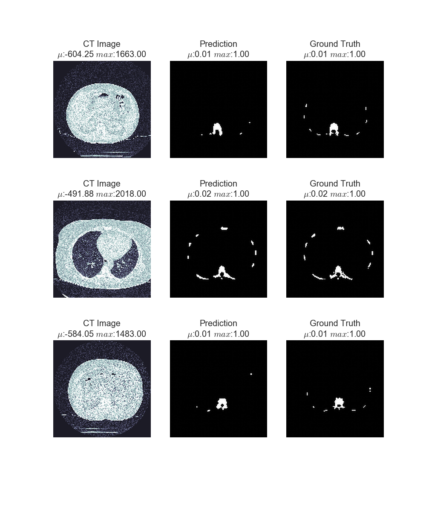

# Bone Segmenter
A modification of the Prostate Segmenter library using our bone segmentation routines with CT images

## Slicer Integration

Using the DeepInfer plugin the image can be called interactively on a image loaded in Slicer. Here we show the results using the Chest CT image from the Sample Data



# Docker Image

## CPU

##### Downloading the docker image from the hub
```
docker pull 4Quant/bone-segmenter-cpu
```

##### Building the docker
```
docker build -t 4quant/bone-segmenter-cpu -f Dockerfile.cpu .
```

##### Running the docker
```
docker run -t -v [Absolute PATH to the Project Folder]/Bone-Segmenter/data/test/:/home/deepinfer/data 4Quant/bone-segmenter-cpu --InputVolume /home/deepinfer/data/input.nrrd --OutputLabel /home/deepinfer/data/label_predicted_test.nrrd
```

Windows Example
```
docker run -t -v "C:\Users\Kevin Mader\Dropbox\4Quant\Projects\Bone-Segmenter":/home/deepinfer/data bone-segmenter-cpu --InputVolume /home/deepinfer/data/CTChest.nrrd --OutputLabel /home/deepinfer/data/label_predicted_test.nrrd
```

# Results

## Predictions
The predictions so two random images from the validation set including the predictions (middle column) by the network and the ground truth (right column). While the network does not always find smaller bones like ribs, it manages to accurately find vertebrae and hips.



## Training Score

Here we show the training progress and corresponding DICE score.

